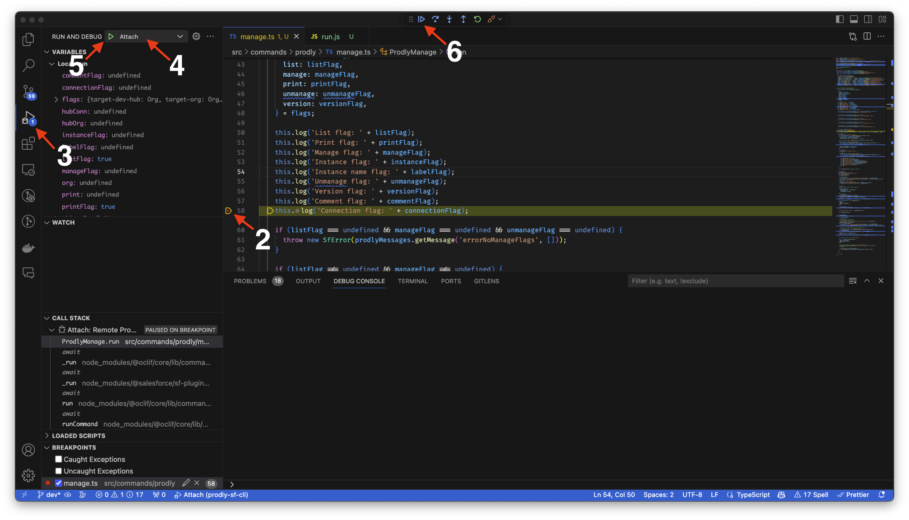

# prodlysfcli

[](https://www.npmjs.com/package/prodlysfcli) [](https://npmjs.org/package/prodlysfcli) [](https://opensource.org/license/apache-2-0)

## Install

```bash
sf plugins install prodlysfcli@x.y.z
```

## Issues

Please report any issues at https://github.com/prodly/prodly-sf-cli/issues

### Build

To build the plugin locally, make sure to have yarn installed and run the following commands:

```bash
# Clone the repository
git clone https://github.com/prodly/prodly-sf-cli.git

# Install the dependencies and compile
yarn && yarn build
```

```bash
# Run using local run file.
./bin/run.js prodly:manage -l -p
```

There should be no differences when running via the Salesforce CLI or using the local run file. However, it can be useful to link the plugin to do some additional testing or run your commands from anywhere on your machine.

```bash
# Link your plugin to the sf cli
sf plugins link .
# To verify
sf plugins
```

## Commands

<!-- commands -->
* [`sf prodly branch-folders`](#sf-prodly-branch-folders)
* [`sf prodly change-types`](#sf-prodly-change-types)
* [`sf prodly checkin`](#sf-prodly-checkin)
* [`sf prodly checkout`](#sf-prodly-checkout)
* [`sf prodly deploy`](#sf-prodly-deploy)
* [`sf prodly jobs`](#sf-prodly-jobs)
* [`sf prodly manage`](#sf-prodly-manage)
* [`sf prodly releases`](#sf-prodly-releases)
* [`sf prodly version`](#sf-prodly-version)

## `sf prodly branch-folders`

prodly:branch-folders command

```
USAGE
  $ sf prodly branch-folders -v <value> -l [--json] [--flags-dir <value>] [--api-version <value>]

FLAGS
  -l, --list                    (required) list all branch folders
  -v, --target-dev-hub=<value>  (required) Username or alias of the Dev Hub org. Not required if the `target-dev-hub`
                                configuration variable is already set.
      --api-version=<value>     Override the api version used for api requests made by this command

GLOBAL FLAGS
  --flags-dir=<value>  Import flag values from a directory.
  --json               Format output as json.

DESCRIPTION
  prodly:branch-folders command

  List all branch folders.

EXAMPLES
  $ sf prodly:branch-folders --target-dev-hub jsmith@acme.com -l
  Lists all branch folders
```

_See code: [src/commands/prodly/branch-folders.ts](https://github.com/prodly/prodly-sf-cli/blob/v1.5.0/src/commands/prodly/branch-folders.ts)_

## `sf prodly change-types`

prodly:change-types command

```
USAGE
  $ sf prodly change-types -v <value> [--json] [--flags-dir <value>] [--api-version <value>] [-t <value>] [-l] [-c] [-n
    <value>] [-u <value>]

FLAGS
  -c, --create                  create a scratch org from a change type
  -l, --list                    list all change types or specific change type
  -n, --name=<value>            name to use for the scratch org
  -t, --id=<value>              change type ID
  -u, --username=<value>        username to use for the scratch org
  -v, --target-dev-hub=<value>  (required) Username or alias of the Dev Hub org. Not required if the `target-dev-hub`
                                configuration variable is already set.
      --api-version=<value>     Override the api version used for api requests made by this command

GLOBAL FLAGS
  --flags-dir=<value>  Import flag values from a directory.
  --json               Format output as json.

DESCRIPTION
  prodly:change-types command

  List all or a specific change type and create scratch org from a change type.

EXAMPLES
  $ sf prodly:change-types --target-dev-hub jsmith@acme.com -l
  Lists all the change types

  $ sf prodly:change-types --target-dev-hub jsmith@acme.com -l -t a1h3t00000JN9lhAAD
  Lists a specific change type

  $ sf prodly:change-types --target-dev-hub jsmith@acme.com -c -n "SO FROM CLI" -u "username@example.com" -t a1h3t00000JN9lhAAD
  Creates a scratch org based on a change type
```

_See code: [src/commands/prodly/change-types.ts](https://github.com/prodly/prodly-sf-cli/blob/v1.5.0/src/commands/prodly/change-types.ts)_

## `sf prodly checkin`

prodly:checkin command

```
USAGE
  $ sf prodly checkin -v <value> -o <value> -c <value> [--json] [--flags-dir <value>] [-f <value>] [-b <value>] [-t
    <value>] [-q <value>] [-i <value>] [-z <value>] [-p <value>]

FLAGS
  -b, --branch=<value>          branch name for deployment
  -c, --comment=<value>         (required) comment for the command versioning commit
  -f, --data-folder=<value>     data branch folder id to use
  -i, --instance=<value>        managed instance ID on which to perform the action
  -o, --target-org=<value>      (required) Username or alias of the target org. Not required if the `target-org`
                                configuration variable is already set.
  -p, --plan=<value>            name or record ID of the deployment plan to deploy
  -q, --filter=<value>          query filter override for a data set deployment
  -t, --dataset=<value>         name or record ID of the data set to deploy
  -v, --target-dev-hub=<value>  (required) Username or alias of the Dev Hub org. Not required if the `target-dev-hub`
                                configuration variable is already set.
  -z, --notes=<value>           notes for the deployment

GLOBAL FLAGS
  --flags-dir=<value>  Import flag values from a directory.
  --json               Format output as json.

DESCRIPTION
  prodly:checkin command

  Save data from a Salesforce environment to a VCS repository branch.

EXAMPLES
  $ sf prodly:checkin --target-org test-utxac7gbati9@example.com --target-dev-hub jsmith@acme.com
  Save managed data to the branch associated with the managed instance identified by the target username.
  The instance should be managed by the Prodly account associated with the provided DevHub control org.

  $ sf prodly:checkin --target-org test-utxac7gbati9@example.com
  Save managed data to the branch associated with the managed instance identified by the target username.
  The instance should be managed by the Prodly account associated with the default DevHub control org.

  $ sf prodly:checkin -i f50616b6-57b1-4941-802f-ee0e2506f217
  Save managed data to the branch associated with the managed instance identified by the provided ID.
  The instance should be managed by the Prodly account associated with the default DevHub control org.
```

_See code: [src/commands/prodly/checkin.ts](https://github.com/prodly/prodly-sf-cli/blob/v1.5.0/src/commands/prodly/checkin.ts)_

## `sf prodly checkout`

prodly:checkout command

```
USAGE
  $ sf prodly checkout -v <value> -o <value> [--json] [--flags-dir <value>] [-f <value>] [-b <value>] [-t <value>]
    [-e] [-q <value>] [-i <value>] [-n <value>] [-z <value>] [-p <value>]

FLAGS
  -b, --branch=<value>          branch name for deployment
  -e, --deactivate              deactivate all events for the deployment
  -f, --data-folder=<value>     data branch folder id to use
  -i, --instance=<value>        managed instance ID on which to perform the action
  -n, --name=<value>            name for the deployment
  -o, --target-org=<value>      (required) Username or alias of the target org. Not required if the `target-org`
                                configuration variable is already set.
  -p, --plan=<value>            name or record ID of the deployment plan to deploy
  -q, --filter=<value>          query filter override for a data set deployment
  -t, --dataset=<value>         name or record ID of the data set to deploy
  -v, --target-dev-hub=<value>  (required) Username or alias of the Dev Hub org. Not required if the `target-dev-hub`
                                configuration variable is already set.
  -z, --notes=<value>           notes for the deployment

GLOBAL FLAGS
  --flags-dir=<value>  Import flag values from a directory.
  --json               Format output as json.

DESCRIPTION
  prodly:checkout command

  Deploy data from a VCS repository branch to a Salesforce environment.

EXAMPLES
  $ sf prodly:checkout --target-org test-utxac7gbati9@example.com --target-dev-hub jsmith@acme.com
  Deploy managed data to the managed instance identified by the target org from the associated branch.
  The instance should be managed by the Prodly account associated with the provided DevHub control org.

  $ sf prodly:checkout --target-org test-utxac7gbati9@example.com
  Deploy managed data to the managed instance org identified by the target username from the associated branch.
  The instance should be managed by the Prodly account associated with the default DevHub control org.

  $ sf prodly:checkout -i f50616b6-57b1-4941-802f-ee0e2506f217
  Deploy managed data to the managed instance org from the associated branch.
  The instance should be managed by the Prodly account associated with the default DevHub control org.
```

_See code: [src/commands/prodly/checkout.ts](https://github.com/prodly/prodly-sf-cli/blob/v1.5.0/src/commands/prodly/checkout.ts)_

## `sf prodly deploy`

prodly:deploy command

```
USAGE
  $ sf prodly deploy -v <value> -o <value> [--json] [--flags-dir <value>] [-t <value>] [-e] [-d <value>] [-q
    <value>] [-b <value>] [-n <value>] [-z <value>] [-p <value>] [-l] [-s <value>]

FLAGS
  -b, --label=<value>           connection and managed instance name
  -d, --destination=<value>     destination managed instance ID
  -e, --deactivate              deactivate all events for the deployment
  -l, --simulation              perform a data simulation
  -n, --name=<value>            name for the deployment
  -o, --target-org=<value>      (required) Username or alias of the target org. Not required if the `target-org`
                                configuration variable is already set.
  -p, --plan=<value>            name or record ID of the deployment plan to deploy
  -q, --filter=<value>          query filter override for a data set deployment
  -s, --source=<value>          source managed instance ID
  -t, --dataset=<value>         name or record ID of the data set to deploy
  -v, --target-dev-hub=<value>  (required) Username or alias of the Dev Hub org. Not required if the `target-dev-hub`
                                configuration variable is already set.
  -z, --notes=<value>           notes for the deployment

GLOBAL FLAGS
  --flags-dir=<value>  Import flag values from a directory.
  --json               Format output as json.

DESCRIPTION
  prodly:deploy command

  Deploy data from one Salesforce environment directly to another Salesforce environment.

EXAMPLES
  $ sf prodly:deploy -n scratchorg --target-org FixesScratchOrg -v MainDevHub
  Command output... deploying from the dev hub, the control org, to the scratch org, auto managed with provided name.

  $ sf prodly:deploy --target-org test-utxac7gbati9@example.com --target-dev-hub jsmith@acme.com
  Command output... deploying from the dev hub, the control org, to the scratch org. Long param names.

  $ sf prodly:deploy --target-org test-utxac7gbati9@example.com -v jsmith@acme.com -d "UAT Sandbox Connection"
  Command output... deploying from the scratch org to the UAT sandbox, using the named connection record in the dev hub, control org.

  $ sf prodly:deploy --target-org test-utxac7gbati9@example.com --target-dev-hub jsmith@acme.com --source "UAT Sandbox Connection"
  Command output... deploying to the scratch org from the UAT sandbox, using the named connection record in the dev hub, control org. Long param names.
```

_See code: [src/commands/prodly/deploy.ts](https://github.com/prodly/prodly-sf-cli/blob/v1.5.0/src/commands/prodly/deploy.ts)_

## `sf prodly jobs`

prodly:jobs command

```
USAGE
  $ sf prodly jobs -v <value> -j <value> [--json] [--flags-dir <value>]

FLAGS
  -j, --job=<value>             (required) Prodly Job ID
  -v, --target-dev-hub=<value>  (required) Username or alias of the Dev Hub org. Not required if the `target-dev-hub`
                                configuration variable is already set.

GLOBAL FLAGS
  --flags-dir=<value>  Import flag values from a directory.
  --json               Format output as json.

DESCRIPTION
  prodly:jobs command

  Check the job status.

EXAMPLES
  $ sf prodly:jobs -j jobId -v MainDevHub
  Print the job status for the provided job Id.
```

_See code: [src/commands/prodly/jobs.ts](https://github.com/prodly/prodly-sf-cli/blob/v1.5.0/src/commands/prodly/jobs.ts)_

## `sf prodly manage`

prodly:manage command

```
USAGE
  $ sf prodly manage -v <value> -o <value> [--json] [--flags-dir <value>] [-c <value>] [-n <value>] [-i <value>]
    [-b <value>] [-l] [-m] [-p] [-x] [-s]

FLAGS
  -b, --label=<value>           connection and managed instance name
  -c, --comment=<value>         comment for the command versioning commit
  -i, --instance=<value>        managed instance ID on which to perform the action
  -l, --list                    list all managed instances
  -m, --manage                  manage a new instance
  -n, --connection=<value>      connection to use for the managed instance
  -o, --target-org=<value>      (required) Username or alias of the target org. Not required if the `target-org`
                                configuration variable is already set.
  -p, --print                   print the managed instances in a standard format in addition to returning structured
                                data
  -s, --version                 version the new managed instance, branch created and data deployed to the org
  -v, --target-dev-hub=<value>  (required) Username or alias of the Dev Hub org. Not required if the `target-dev-hub`
                                configuration variable is already set.
  -x, --unmanage                unmanage the specified instance

GLOBAL FLAGS
  --flags-dir=<value>  Import flag values from a directory.
  --json               Format output as json.

DESCRIPTION
  prodly:manage command

  Authorize (or unauthorize) a Salesforce environment (not already added to the Environments page in Release tab) for
  use by the plugin.

EXAMPLES
  $ sf prodly:manage -l -p
  List and print all of the managed instances for the Prodly account associated with the default DevHub control org.

  $ sf prodly:manage -m --target-org test-utxac7gbati9@example.com --target-dev-hub jsmith@acme.com
  Manage the org associated with the target username under the Prodly account associated with the provided DevHub control org.

  $ sf prodly:manage -m --target-org test-utxac7gbati9@example.com -n dev7sbx
  Manage and version the org associated with the target username under the Prodly account associated with the default DevHub control org.
```

_See code: [src/commands/prodly/manage.ts](https://github.com/prodly/prodly-sf-cli/blob/v1.5.0/src/commands/prodly/manage.ts)_

## `sf prodly releases`

prodly:releases command

```
USAGE
  $ sf prodly releases -v <value> [--json] [--flags-dir <value>] [--api-version <value>] [-a] [-l | [-d -i <value> -r
    <value>] | ] [-n]

FLAGS
  -a, --deactivate-all-events   deactivate all events for the release
  -d, --deploy                  deploy a release
  -i, --instance=<value>        managed instance ID on which to perform the action
  -l, --list                    list all releases
  -n, --validation              perform a data/metadata validation
  -r, --release-id=<value>      release Id to deploy
  -v, --target-dev-hub=<value>  (required) Username or alias of the Dev Hub org. Not required if the `target-dev-hub`
                                configuration variable is already set.
      --api-version=<value>     Override the api version used for api requests made by this command

GLOBAL FLAGS
  --flags-dir=<value>  Import flag values from a directory.
  --json               Format output as json.

DESCRIPTION
  prodly:releases command

  List all releases and deploy a release.

EXAMPLES
  $ sf prodly:releases --target-dev-hub jsmith@acme.com -l
  Lists all the releases

  $ sf prodly:releases --target-dev-hub jsmith@acme.com -d -i "f50616b6-57b1-4941-802f-ee0e2506f217" -r "a5H6e0000024xKUEAY"
  Creates a release given a release id and a destination instance id
  The instance should be managed by the Prodly account associated with the default DevHub control org.
```

_See code: [src/commands/prodly/releases.ts](https://github.com/prodly/prodly-sf-cli/blob/v1.5.0/src/commands/prodly/releases.ts)_

## `sf prodly version`

prodly:version command

```
USAGE
  $ sf prodly version -v <value> -o <value> [--json] [--flags-dir <value>] [-b <value>] [-s <value>] [-i <value>]
    [-x]

FLAGS
  -b, --new-branch=<value>      if provided it creates a new branch based on the source branch that will be used for
                                version control
  -i, --instance=<value>        managed instance ID on which to perform the action
  -o, --target-org=<value>      (required) Username or alias of the target org. Not required if the `target-org`
                                configuration variable is already set.
  -s, --source-branch=<value>   the version control branch or the base for the new branch (if provided)
  -v, --target-dev-hub=<value>  (required) Username or alias of the Dev Hub org. Not required if the `target-dev-hub`
                                configuration variable is already set.
  -x, --unlink                  unlink the branch from the managed instance

GLOBAL FLAGS
  --flags-dir=<value>  Import flag values from a directory.
  --json               Format output as json.

DESCRIPTION
  prodly:version command

  Adds version control to a managed environment.

EXAMPLES
  $ sf prodly:version -s main
  Add version control to the managed instance identified by the target org. Use the "main" branch.
  The instance should be managed by the Prodly account associated with the default DevHub control org.

  $ sf prodly:version -s main -b cli-branch -i f50616b6-57b1-4941-802f-ee0e2506f217
  Add version control to the managed instance identified by the provided ID. Use the "main" branch as a base for a new branch called "cli-branch"
  The instance should be managed by the Prodly account associated with the default DevHub control org.

  $ sf prodly:version -x -i f50616b6-57b1-4941-802f-ee0e2506f217
  Remove version control from the managed instance identified by the provided ID.
  The instance should be managed by the Prodly account associated with the default DevHub control org.
```

_See code: [src/commands/prodly/version.ts](https://github.com/prodly/prodly-sf-cli/blob/v1.5.0/src/commands/prodly/version.ts)_
<!-- commandsstop -->

<!-- debugging-your-plugin -->

# Debugging your plugin

We recommend using the Visual Studio Code (VS Code) IDE for your plugin development. Included in the `.vscode` directory of this plugin is a `launch.json` config file, which allows you to attach a debugger to the node process when running your commands.

To debug the `prodly:manage -l -p` command:

1. Start the inspector

Call your command using the `bin/run.js` script, set the `NODE_OPTIONS` environment variable to `--inspect-brk` when starting the debugger:

```sh-session
$ NODE_OPTIONS=--inspect-brk bin/run.js prodly:manage -l -p
```

2. Set some breakpoints in your command code
3. Click on the Run and Debug icon in the Activity Bar on the side of VS Code to open up the Debug view.
4. In the upper left hand corner of VS Code, verify that the "Attach" launch configuration has been chosen.
5. Hit the green play button to the left of the "Attach" launch configuration window. The debugger should now be suspended on the first line of the program.
6. Hit the blue play button at the top middle of VS Code (this play button will be to the right of the play button that you clicked in step #5).
   <br><br>
   Congrats, you are debugging!
